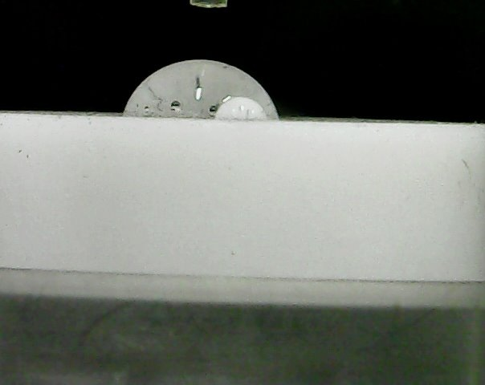

# Droplet Contact Angle Calculation

This project calculates the contact angle of droplets in images. The script processes images in the working folder and logs the results.

## Authors

- Lyrie Edler
- Yehonathan Barda

## Requirements

- Python 3.x
- OpenCV
- NumPy
- Matplotlib

## Installation

1. Clone the repository:
    ```sh
    git clone <repository-url>
    cd <repository-directory>
    ```

2. Install the required libraries:
    ```sh
    pip install opencv-python numpy matplotlib
    ```

## Usage

1. Place your images in the working folder (default is the current directory).
2. Run the script:
    ```sh
    python dropplet_run.py
    ```
3. The results will be stored in `results.log`.

## Image Requirements

- The image should be taken side-on with the droplet on a flat surface.
- The surface needs to be horizontal (small angle within the image plane is acceptable) and at eye level with the camera.
- The droplet should be clearly visible with a distinct boundary.
- The background should be clean and uniform to avoid interference:
  - For Teflon surface, a black background is recommended.
  - For copper surface, a light-colored background is recommended.
- The image should be in focus and well-lit to ensure accurate detection.
- Avoid any reflections on the droplet or the surface.
- You may need to crop the image to focus on the droplet and surface only.
- Example images are provided in the repository (Example_Images folder).

## Example Image

Here is an example image of a droplet on a Teflon surface:



## Parameters

You can adjust the parameters for image processing by creating a `parameters.txt` file with the following values:
```plaintext
CLIP_LIMIT = 3.0 # Contrast Limited Adaptive Histogram Equalization (CLAHE) clip limit
THRESHHOLD1 = 50 # Canny edge detection lower threshold
THRESHHOLD2 = 150 # Canny edge detection upper threshold
POINTS_TO_TAKE = 30  # Number of points to consider for surface line detection
HEIGHT_THRESHHOLD_START = 40 # Minimum height difference to consider a point
HEIGHT_THRESHHOLD_FINISH = 5 # Maximum height difference to consider a point
JUMP_THRESHHOLD = 2 # Maximum jump in X to consider a point
MIN_POINTS_TO_FIND = 4 # Minimum points to consider a line
```

Place the `parameters.txt` file in the same directory as the script.

## License

This project is licensed under the MIT License.