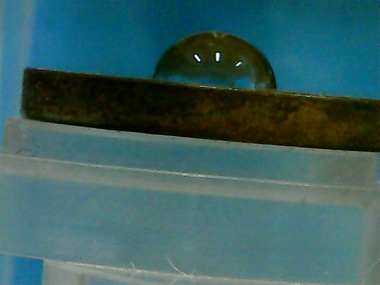

# Droplet Contact Angle Calculation 

This project calculates the contact angle of droplets in images. The script processes images in the working folder and logs the results.

## Authors

- Lyrie Edler
- Yehonathan Barda

## Requirements

To run this project, you need to have the following packages installed:

- `os` (standard library)
- `tkinter` (standard library)
- `Pillow`
- `subprocess` (standard library)
- `webbrowser` (standard library)
- `opencv-python`
- `numpy`
- `matplotlib`

You can install the required packages using `pip`:

```sh
pip install Pillow opencv-python numpy matplotlib
```

## Installation

1. Clone the repository:
    ```sh
    git clone https://github.com/YehonathanBarda/dropletscript.git <target_directory_path>
    ```

2. Install the required libraries (if not already installed) :
    ```sh
    pip install opencv-python numpy matplotlib PIL
    ```
3. Create Shortcut for the `run_droplet_ui.vbs` file. (you can change its icon to the droplet_icon.ico in the icon folder)

## Usage
#### With UI (Only for Windows)
1. Open run_droplet_ui.vbs or click the shortcut if it exists.
2. Choose image files
3. Name the LOG file (the results file)
4. Choose directory for the results
5. Choose the Log Mod: either Overwrite or Append to the existing file.
7. Click Run
8. The intermediate results will be displayed. Make sure that the drop and surface are detected correctly. 
9. Prass q continue to the next image.
10. When calculation is complite, click on 'Open Log file' to see the results.

#### Directly from python
1. Place your images in the working folder (default is the current directory).
2. Run the script (droplet_run.py). in any way you like, for example using the CMD (to open clilck window key, write cmd, click enter):
    ```sh
    cd <repository-directory>
    python droplet_run.py
    ```
4. The intermediate results will be displayed. Make sure that the drop and surface are detected correctly.
5. Prass q continue to the next image.
6. The results will be stored in `results.log`.

## Image Requirements

- The image should be taken side-on with the droplet on a flat surface.
- The surface needs to be horizontal (small angle within the image plane is acceptable) and at eye level with the camera.
- The droplet should be clearly visible with a distinct boundary.
- The background should be clean and uniform to avoid interference:
  - For Teflon surface, a black background is recommended.
  - For copper surface, a light-colored background is recommended.
- The image should be in focus and well-lit to ensure accurate detection.
- Avoid any reflections on the droplet or the surface.
- You may need to crop the image to focus on the droplet and surface only.
- Example images are provided in the repository (Example_Images folder).

### Example Image

Here is an example image of a droplet on a Teflon surface:


Here is an example image of a droplet on a Copper surface:



## Parameters

You can adjust the parameters for image processing by creating a `parameters.txt` file with the following values:
```plaintext
CLIP_LIMIT = 3.0 # Contrast Limited Adaptive Histogram Equalization (CLAHE) clip limit
THRESHOLD1 = 50 # Canny edge detection lower threshold
THRESHOLD2 = 150 # Canny edge detection upper threshold
POINTS_TO_TAKE = 30  # Number of points to consider for surface line detection
HEIGHT_THRESHOLD_START = 40 # Minimum height difference to consider a point
HEIGHT_THRESHOLD_FINISH = 5 # Maximum height difference to consider a point
JUMP_THRESHOLD = 2 # Maximum jump in X to consider a point
MIN_POINTS_TO_FIND = 4 # Minimum points to consider a line
```

Place the `parameters.txt` file in the same directory as the script.

***NEW***
* You now can feed the `parameters.txt` through the function `calculate_contact_angle` using the Params_path parameters. see more in the docstring.
* You now can feed the `parameters.txt` through the UI by selecting it. 


## License

This project is licensed under the MIT License.
